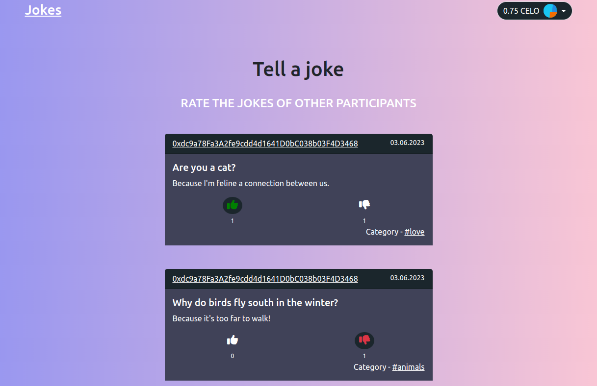
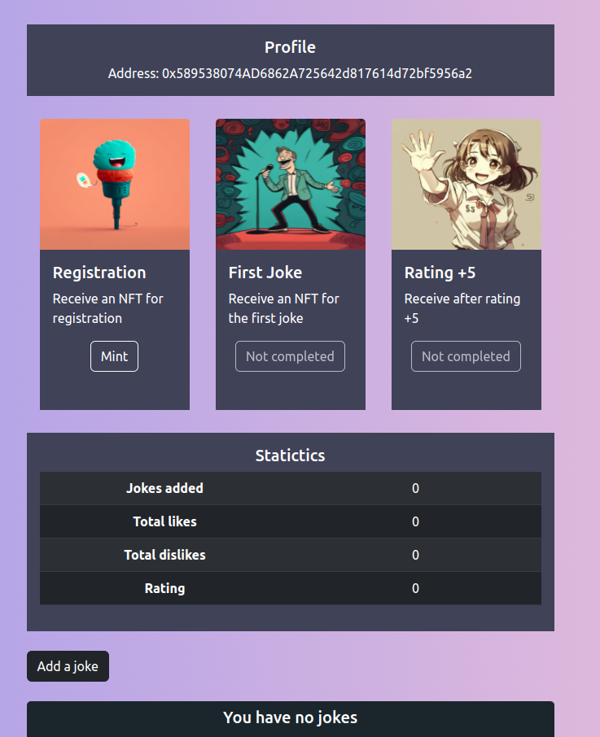
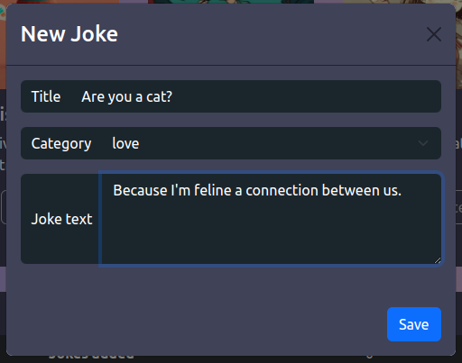
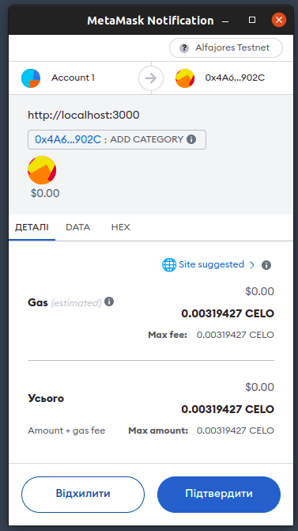
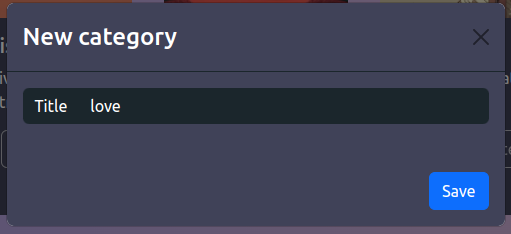
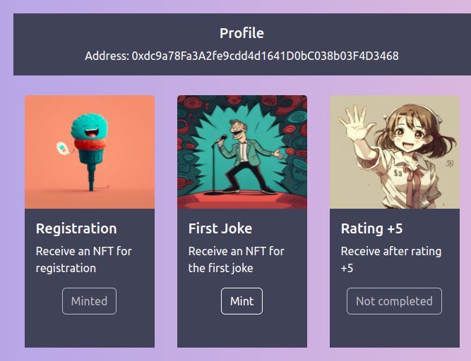
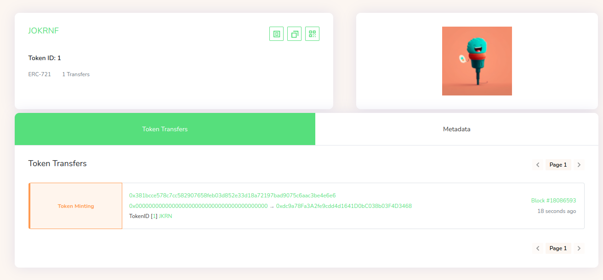
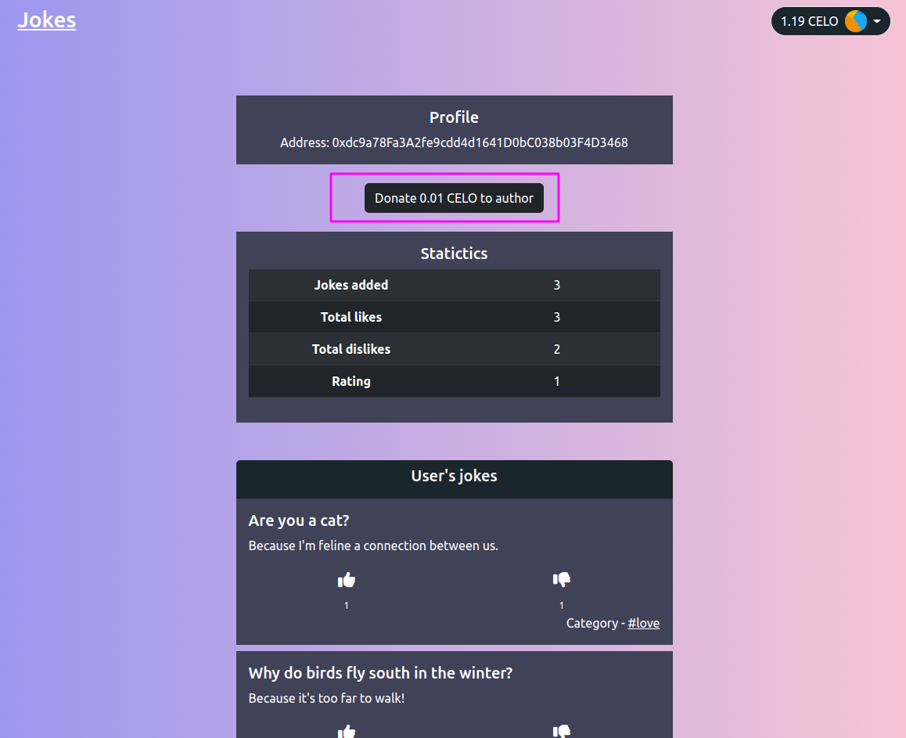

# CELO Jokes DAPP

## Table of Contents

-   [Description](#description)
-   [Demo site](#site-demo)
-   [Technologies](#technologies)
-   [Installation](#installation)
-   [Usage](#usage)
-   [License](#license)

# Description


This is a web application for users to create jokes and react to other's jokes. A dapp has 3 pages: Index, Profile and Leaderboard. An author can create/edit/remove his own jokes.

User can see other users profile and jokes by a specific category, but only owner can add new categories.

After getting a specific achievement, user can mint an NFT.

# Demo site

DEMO LINK [Celo React Jokes DAPP](https://andrew-celo-react.netlify.app)

##NOTE
WALLET REQUIRED TO TEST THIS DAPP IS [CeloExtensionWallet](https://chrome.google.com/webstore/detail/celoextensionwallet/kkilomkmpmkbdnfelcpgckmpcaemjcdh)


# Technologies

* [Webpack](https://webpack.js.org)
* [Solidity](https://soliditylang.org)
* [HTML5](https://developer.mozilla.org/en-US/docs/Web/HTML)
* [JavaScript](https://developer.mozilla.org/en-US/docs/Web/JavaScript)
* [ReactJS](https://react.dev)
* [CSS](https://developer.mozilla.org/en-US/docs/Web/CSS)
* [Bootstrap](https://react-bootstrap.netlify.app)

# Installation

Open Terminal {Ctrl+Alt+T}

```sh
https://github.com/Andr3wHolovchuk/celo-react-jokes-dapp.git
```

```sh
cd celo-react-jokes-dapp
```

This project uses [node](http://nodejs.org) and [npm](https://npmjs.com). Go check them out if you don't have them locally installed.

```sh
cd frontend && npm ci

cd backend && npm ci
```

## Compile and deploy contract

```sh
npm run compile && npm run deploy
```

## Start a development server for the client

```sh
npm run dev
```

## Start a development server

```sh
node index.js
```

## Build

```sh
npm run build
```
# Usage
1. Install the [CeloExtensionWallet](https://chrome.google.com/webstore/detail/celoextensionwallet/kkilomkmpmkbdnfelcpgckmpcaemjcdh) from the google chrome store.
2. Create or import a wallet.
3. Go to [https://celo.org/developers/faucet](https://celo.org/developers/faucet) and get tokens for the alfajores testnet.
4. Switch to the alfajores testnet in the CeloExtensionWallet.

# Site Overview
## Index Page
On the main page, the user can see the jokes of all users, in addition, he can rate these jokes by liking or disliking them. A joke has its own category, title and the text of the joke itself.

[<p align="center"></p>][def]

## Profile Page
On the profile page there are jokes added by the user, and his statistics, namely the number of added jokes, dislikes, likes and rating.In addition, on the profile page we can get nft

If the user is the owner of the contract, he can add new categories.

[<p align="center"></p>][def]

Model window for creating a new joke.

[<p align="center"></p>][def]

Contract modal window after creating a new joke.

[<p align="center"></p>][def]

Category creation modal window.

[<p align="center"></p>][def]
 
## NFT Block 

Users can mint an NFT for the registration, creating of the first joke and getting a +5 rating.

[<p align="center"></p>][def]

View of the received NFT on Celo Explorer

[<p align="center"></p>][def]


Also, users can donate to other authors 0.1 CELO

[<p align="center"></p>][def]
---

## License
> [MIT License](https://opensource.org/licenses/MIT) &copy; [LICENSE](LICENSE)

[def]: images